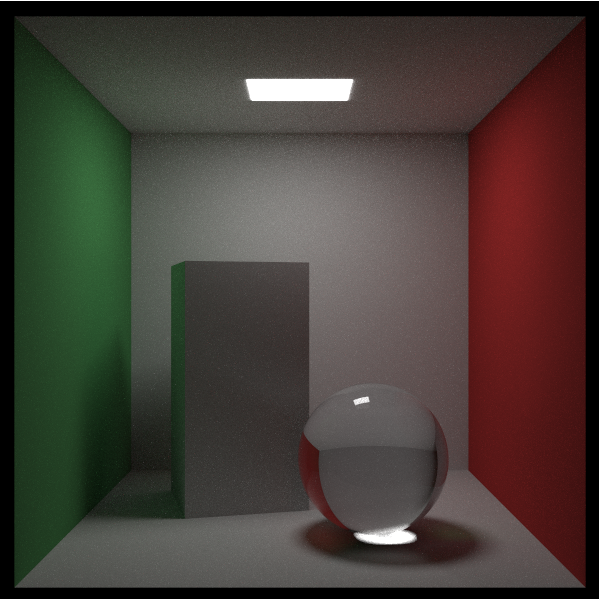

# Raytracing in One Weekend

A Go implementation of the [Raytracing in One Weekend](https://raytracing.github.io/) book series.

Features:
- Multihreading with goroutines
- PNG image support
- Texturing
- Usage of BVH acceleration structure
- Diffuse, metal and dielectric materials
